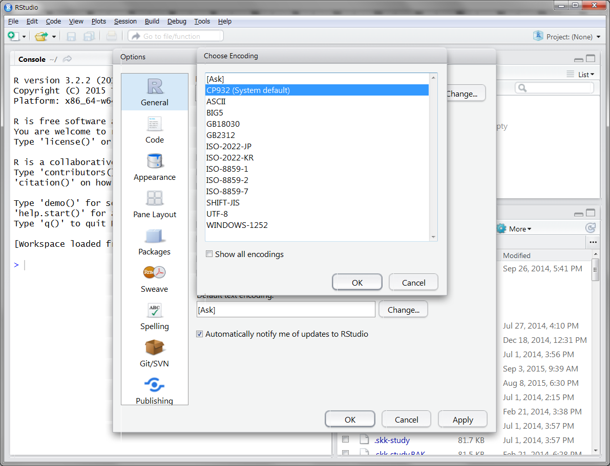

新米探偵、データ分析に挑む
==================================================
著者：石田基広
出版社: SBクリエイティブ
ISBN-13: 978-4797382303
発売日:2015/10/28
URL: [SBCr](http://isbn.sbcr.jp/82303)
     [author](https://github.com/IshidaMotohiro/Detectives)
     [AMAZON](http://www.amazon.co.jp/dp/4797382309/)

付録：データおよびRスクリプト

## 本書の特徴
1. データ分析の初歩から（入門書にはない）高度な話題までを紹介している
2. 物語(ストーリー)仕立てなので、結末を楽しみながらスラスラと読み進められる
3. 書籍の内容（実際のデータ分析）を無料(フリー)のソフトで実行することができる

## R および RStudio のインストールについて

本書の番外編を参照してください。

- [R](http://cran.ism.ac.jp/)
- [RStudio](https://www.rstudio.com/products/rstudio/download/)

あるいは以下のサイトが参考になるでしょう。難しいことはありません。利用しているパソコン(OS)に適合したファイルをダウンロードしてダブルクリックするだけです。

 - [竹澤邦夫先生のサイト(少し古いが手順はほぼ同じ)](http://cse.naro.affrc.go.jp/takezawa/r-tips/r/01.html)
 - [三重大学奥村晴彦先生のサイト Windows](https://oku.edu.mie-u.ac.jp/~okumura/stat/R-win.html)
 - [動画で見る(統合TV)](http://togotv.dbcls.jp/20140221.html)
 
## データのダウンロードについて

本書で扱っているデータは、このサイトの右にある [Download Zip](https://github.com/IshidaMotohiro/Detectives/archive/master.zip) というリンクからダウロードできます。クリックすると、本書の全データをzip形式で圧縮したファイル __Detectives-master.zip__ を保存できます。ダブルクリックして解凍するとAmosMacとAmosWINの2つのフォルダがありますので、パソコンに合わせてどちらかを利用してください。フォルダ内部はさらに章ごとにサブフォルダに分かれています。RStudioを起動後、右ペイン上のプロジェクト・ボタンから __New Project__ を選び、次のダイアログで __Existing Directory__ へと進み、上で解凍された2つのフォルダのいずれかを選択して、__Create Project__ を押すと、本書用のプロジェクトが作成されます。

右下のFilesタブから、各章ごとに用意されたChapで始まるファイルをクリックすると左上に表示されます。
なお日本語などの設定を行うために __Prepare.R__ というスクリプトが用意されていますので、最初にこのファイルを開いて、記載された指示に従って操作してください

## RStudio でファイルを開くと文字化けする場合

特にWindowsで利用している場合に起こることがあるのですが、スクリプトを開いてみると中身が文字化けしていることはあります。この場合は以下の対処をしてみてください。

1. ウィンドウ上部のメニューから File -> Reopen with Encoding と操作し、表示されたダイアログで文字コードを選んでOKを押す
 - Windowsならば __CP932__
 - Mac ならば __UTF-8__

 - 

2. ウィンドウ上部のメニューから Help -> Global Options と操作し、表示されたダイアログで左の __General__ をクリックすると右下に __Default__ __text__ __encoding:__ とあるので __Change...__ を押す。表示されたダイアログで文字コードを選んでOKを押す
 - Windowsならば __CP932__
 - Mac ならば __UTF-8__

- 

## 問い合わせ

 質問があれば ishida.motohiro @ tokushima-u.ac.jp までメールをください
